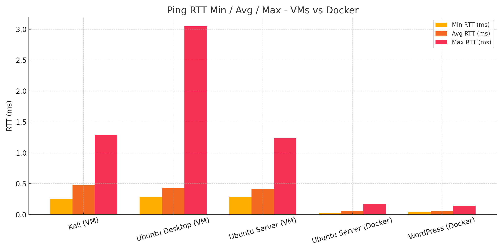

# Comparison: Docker vs VMs

| Feature            | Docker                       | Virtual Machines                |
|--------------------|-------------------------------|----------------------------------|
| Startup Time       | Seconds                       | Minutes                          |
| Resource Usage     | Low                           | High                             |
| Persistence        | Needs Dockerfile or volume    | Yes                              |
| Networking         | Needs setup (`labnet`)        | Easier with dual NIC             |
| Performance Tools  | `top`, `time`, `docker stats` | `htop`, `perf`, `gnome-monitor`  |

**Conclusion:** Docker is lighter and faster for quick testing. VMs are better for full OS experience.
